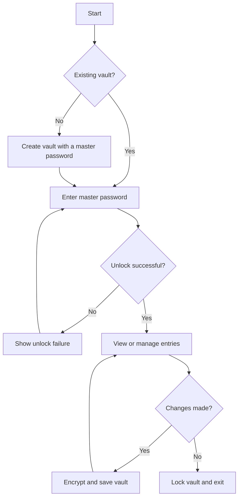

# Password Manager

A password manager project for the ICS0022 Secure Programming course.
The goal is to store login credentials in an encrypted vault and provide access through a master password.

## Project scope

The planned functionality includes:

- Creating a vault protected by a master password;
- Unlocking an existing vault;
- Adding, viewing, editing and deleting saved credentials;
- Saving the vault in encrypted form;
- Locking the vault when finished.

The initial scope is a local, single-user application. Cloud synchronization and sharing vaults between users are outside the initial scope.

## Security goals

Security requirements and threats will guide the design and implementation of each feature. The main goals are to:

- Use established cryptographic libraries instead of custom cryptographic algorithms.
- Derive encryption keys from the master password using a suitable password-based key derivation function and a unique random salt.
- Protect the vault with authenticated encryption to detect tampering.
- Keep master passwords and plaintext credentials out of persistent storage and logs.
- Minimize sensitive data held in memory and document memory-clearing limitations.
- Validate input and handle file operations safely to avoid exposing secrets or corrupting the vault.

These are design goals. Their implementation and verification will be documented as the project develops.

## Planned interface

The interface is planned to support the following actions:

- **Create vault:** create a new vault and choose a master password.
- **Unlock vault:** open a previously created vault using its master password.
- **Manage entries:** add, view, edit and delete saved credentials.
- **Lock vault:** end access to the unlocked vault.

The choice between a command-line interface and application screens will be made during the architecture design stage.

### Proposed user workflow

## Build and run

Build and run instructions will be added as the application is developed. They will cover the required tools and dependencies, installation steps, and commands for starting the application. Each step will be checked before it is documented.

## Checkpoint 1 plan

Deadline: **25 September 2026**.

- [ ] Review and agree on the project scope and planned interface.
- [ ] Describe the architecture, including user management, encryption, storage and the data flow between them.
- [ ] Choose and document the vault format and cryptographic scheme.
- [ ] Document threats and intended mitigations for the master password, vault at rest, vault in memory and interface.
- [ ] Add verified build and run instructions.
- [ ] Review the design document and repository against the checkpoint requirements.

