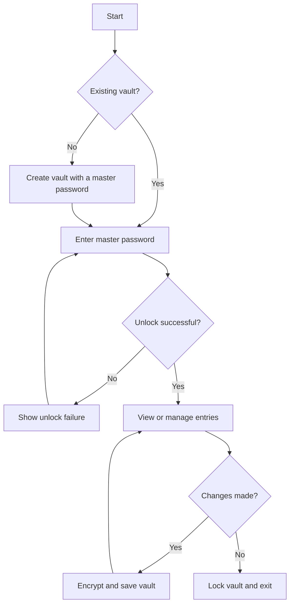

# Password Manager

A password manager project for the ICS0022 Secure Programming course.
The goal is to store login credentials in an encrypted vault and provide access through a master password.

## Project scope

The planned functionality includes:

- Creating a vault protected by a master password;
- Unlocking an existing vault;
- Adding, viewing, editing and deleting saved credentials;
- Saving the vault in encrypted form;
- Locking the vault when finished.

The initial scope is a local, single-user application. Cloud synchronization and sharing vaults between users are outside the initial scope.

## Security goals

Security requirements and threats will guide the design and implementation of each feature. The main goals are to:

- Use established cryptographic libraries instead of custom cryptographic algorithms.
- Derive encryption keys from the master password using a suitable password-based key derivation function and a unique random salt.
- Protect the vault with authenticated encryption to detect tampering.
- Keep master passwords and plaintext credentials out of persistent storage and logs.
- Minimize sensitive data held in memory and document memory-clearing limitations.
- Validate input and handle file operations safely to avoid exposing secrets or corrupting the vault.

These are design goals. Their implementation and verification will be documented as the project develops.

## Planned interface

The interface is planned to support the following actions:

- **Create vault:** create a new vault and choose a master password.
- **Unlock vault:** open a previously created vault using its master password.
- **Manage entries:** add, view, edit and delete saved credentials.
- **Lock vault:** end access to the unlocked vault.

The planned interface is a menu-based command-line application for Windows.

### Proposed user workflow



## Proposed repository structure

The following layout is a design proposal. Source files and build configuration will be added during implementation and the structure may be revised as the project develops.

```text
Pass_manager/
|-- README.md
|-- CMakeLists.txt       # Planned CMake build configuration
|-- docs/
|   |-- checkpoint-1.md
|   `-- threat-model.md
|-- src/                # Planned application sources
`-- tests/              # Planned automated tests
```

The build process will generate `build/`, and the application will use `data/` for local vault files. Both directories will be excluded from Git.

The proposed executable name is `password_manager` (`password_manager.exe` on Windows). The planned `--data-dir <path>` option will select the directory for vault data; relative paths will be resolved from the working directory. The example below selects `data/` in the repository root.

## Planned build and run

Windows with MSYS2 UCRT64 is the proposed primary build environment. WSL/Linux is a possible environment for core development and testing, subject to verification. Full application support there, including clipboard retrieval if selected, would require additional design, implementation and verification.

### Requirements

The planned build environment is 64-bit Windows with a C++20 compiler, CMake 3.20 or newer, Ninja and libsodium.

Install [MSYS2](https://www.msys2.org/) using its default location, `C:\msys64`. Open the **MSYS2 UCRT64** terminal and update its packages:

```bash
pacman -Syu
```

If prompted to close the terminal, reopen MSYS2 UCRT64 and run the update again. Then install the development tools:

```bash
pacman -S --needed mingw-w64-ucrt-x86_64-gcc mingw-w64-ucrt-x86_64-cmake mingw-w64-ucrt-x86_64-ninja mingw-w64-ucrt-x86_64-libsodium
```

### Build and test

The commands below describe the planned implementation using the proposed layout. They will be verified once the initial application and test skeleton is available and updated if the design changes. A documentation-only checkout cannot be built or run yet.

Open PowerShell in the repository root. Make the UCRT64 tools available in that terminal session:

```powershell
$env:Path = "C:\msys64\ucrt64\bin;" + $env:Path
```

If MSYS2 was installed elsewhere, adjust the path. Configure the project, compile it and run its tests, proceeding only if each command succeeds:

```powershell
cmake -S . -B build -G Ninja -DCMAKE_BUILD_TYPE=Release
cmake --build build
ctest --test-dir build --output-on-failure
```

### Run

Once the planned executable and command-line option are implemented and the build succeeds, the intended launch command from the same PowerShell session is:

```powershell
.\build\password_manager.exe --data-dir .\data
```

The intended workflow is to create or unlock a vault, manage entries through the terminal menu and lock the vault before leaving. Runtime files will use the local `data/` directory. Build output and runtime data should be excluded from Git.

## Design documents

- [Architecture and vault design](docs/checkpoint-1.md)
- [Threat model](docs/threat-model.md)
