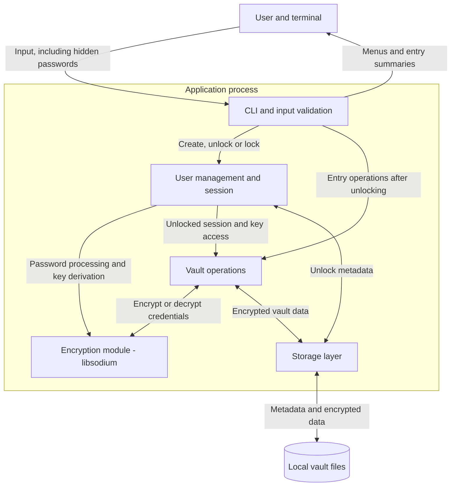

# Checkpoint 1: architecture and vault design

ICS0022 Secure Programming

This document describes intended behaviour.

## Scope and technology choices

The planned application is a local password manager for Windows with a menu-based command-line interface. Users will create or unlock a vault, manage credentials and lock the vault when finished. Shared vaults and cloud synchronization are outside the initial scope.

- **C++20:** supports explicit resource ownership and automatic cleanup through RAII. Careful memory handling and bounds checking will still be necessary.
- **libsodium:** provides password hashing, authenticated encryption, secure random generation and memory-management functions.
- **CMake and CTest:** will organize builds and automated tests.

## Components and data flow

**User management** will handle vault creation, master-password authentication and the unlocked session.

**Vault operations** will coordinate adding, viewing, editing and deleting entries.

**The encryption module** will handle key derivation, encryption and integrity checks.

**The storage layer** will read and save vault files, validate file structure and restrict file access.

These modules will share one application process. Input and files will be treated as untrusted until validated. The operating system, executable and dependencies must be trusted.

## Initial security decisions

**Master password:** use Argon2id through libsodium to derive keys from the master password and a random salt. Store the salt and derivation settings needed to reopen the vault, but never the plaintext master password or derived keys. The cost settings will be selected after checking performance on the target machine.

Reference: [libsodium password hashing](https://doc.libsodium.org/password_hashing/default_phf).

**Vault encryption:** use XChaCha20-Poly1305 authenticated encryption to protect credential contents and detect tampering. Each encryption will use a fresh nonce. The detailed design will also need to authenticate the vault structure so that removing or rearranging records cannot go unnoticed.

Reference: [libsodium XChaCha20-Poly1305](https://libsodium.gitbook.io/doc/secret-key_cryptography/aead/chacha20-poly1305/xchacha20-poly1305_construction).

**Memory and interface:** keep keys only during an unlocked session and clear application-owned secret buffers when no longer needed. Master-password input will not echo, and secrets will not be written to logs. Memory cleanup cannot guarantee removal of copies held by the OS or other programs.

Reference: [libsodium secure memory](https://doc.libsodium.org/memory_management).

## Proposed vault format

The initial proposal is a versioned binary format with:

- **Unlock metadata:** format version, salt and key-derivation settings.
- **Encrypted credentials:** service name, login, password and optional notes.
- **Integrity information:** nonces and authentication tags needed to verify and decrypt the stored data.

Metadata required before unlocking will remain readable. Credential fields will be encrypted. The application will reject unsupported formats and invalid data.

The exact field layout and whether metadata will live in the vault or in a separate file remain open decisions.

## Open decisions and next steps

- Decide whether the initial interface needs separate local account profiles.
- Choose key-derivation cost settings and how successful unlocking will be verified.
- Specify record serialization, input limits and authentication of the complete vault structure.
- Decide how passwords will be retrieved, including any clipboard handling.
- Design safe saving, failure handling and session locking.
- Complete the threat model for the master password, vault at rest, vault in memory and interface.
- Add build and run instructions as the application becomes runnable.
